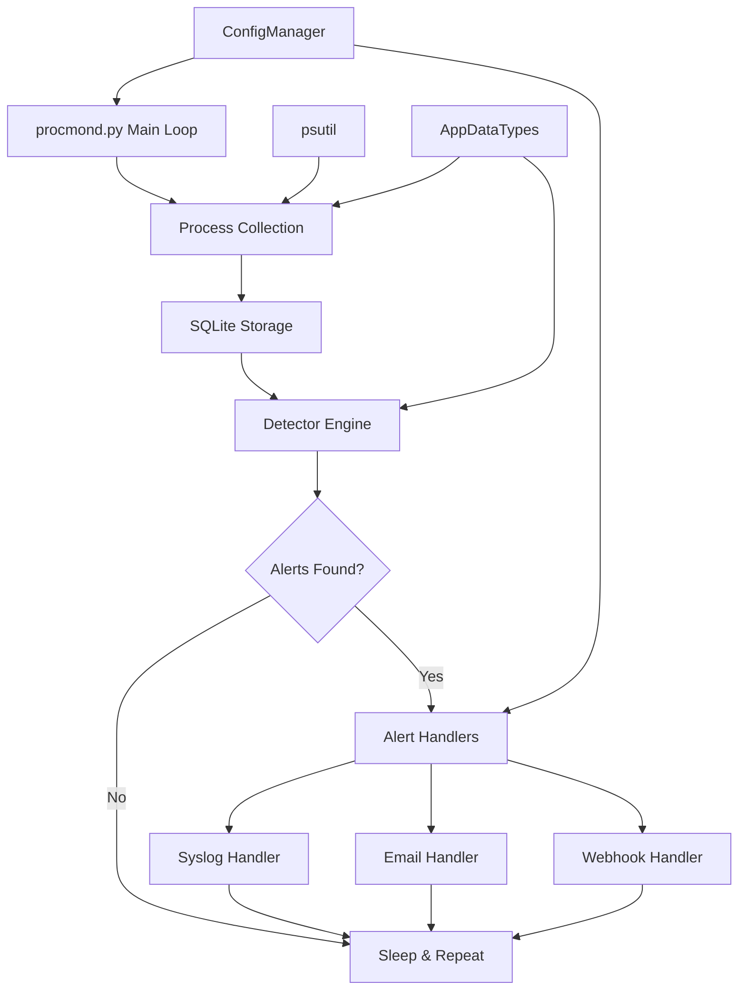

# WARP.md

This file provides guidance to WARP (warp.dev) when working with code in this repository.

## Purpose and Scope

ProcMonD-Prototype is a lightweight process tripwire daemon that inspects running processes for signs of compromise. This file serves as guidance for AI coding assistants (WARP, Claude, etc.) to quickly understand the architecture, conventions, and development workflows for this Python-based security monitoring tool.

## Rules of Engagement for AI Agents

- **Precedence**: Always check for project-specific instructions in this order: `AGENTS.md` → `GEMINI.md` → `.cursor/rules/**/*.mdc` → this `WARP.md`
- **Code Review**: Prefer coderabbit.ai for reviews; avoid GitHub Copilot auto-review
- **Documentation**: Use mermaid diagrams for visual documentation
- **Git Workflow**: Never switch branches, commit, or push on behalf of the user without explicit permission
- **Context**: When users request code examples, setup steps, or library/API documentation, use the context7 MCP tool

## Quick Start

### Prerequisites

- Python 3.10 or newer
- Virtual environment (venv or equivalent)

### Environment Setup

```bash
# Create and activate virtual environment
python3 -m venv .venv
source .venv/bin/activate  # Linux/macOS
# .\\.venv\\Scripts\\Activate.ps1  # Windows PowerShell

# Install dependencies
pip install --upgrade pip
pip install -r requirements.txt

# For exact production versions:
pip install -r requirements.lock
```

### Common Commands

**Development & Testing:**

```bash
# Run single smoke test (no daemon loop)
python run_smoke.py

# Run full test suite
python -m pytest -q

# Run daemon in foreground (debugging)
python procmond.py

# Run daemon with custom config
python procmond.py --config /path/to/procmond.conf
```

**Code Quality:**

```bash
# Format code (ruff is configured in pyproject.toml)
ruff format

# Lint code
ruff check

# Type checking (if mypy is configured)
mypy .
```

**Dependency Management:**

```bash
# Add new dependency (if using modern approach)
# Note: This project uses requirements.txt, not uv yet
pip install <package>
pip freeze > requirements.lock  # Update lock file
```

## Architecture Overview

ProcMonD is a single-process daemon that periodically collects process information, stores it in SQLite, runs detectors against the data to identify suspicious activity, and sends alerts via configurable handlers. The architecture emphasizes simplicity and cross-platform compatibility with Unix-specific features (like python-daemon and syslog) gracefully degrading on Windows.



### Key Components

- **`procmond.py`**: Main daemon entry point with process collection and monitoring loop
- **`ConfigManager.py`**: INI-based configuration loader with CLI argument support
- **`Detectors.py`**: SQL-based detection functions that identify suspicious process behaviors
- **`AppDataTypes/`**: Core data models (`ProcessRecord`, `Alert`)
- **`AlertHandlers/`**: Pluggable alert delivery systems (syslog, email, webhook)

## Project Layout

```text
├── procmond.py              # Main daemon entry point
├── ConfigManager.py         # Configuration management
├── Detectors.py            # SQL-based threat detectors
├── run_smoke.py            # Quick smoke test harness
├── AppDataTypes/           # Core data models
│   ├── ProcessRecord.py    # Process metadata & file operations
│   └── Alert.py           # Alert data structure
├── AlertHandlers/          # Alert delivery modules
│   ├── SyslogAlertHandler.py
│   ├── EmailAlertHandler.py
│   └── WebHookAlertHandler.py
├── tests/                  # Unit tests
├── docs/                   # Deployment guides
├── pyproject.toml          # Ruff configuration
├── requirements.txt        # Runtime dependencies
└── requirements.lock       # Pinned versions
```

## Development Workflow

### Running Locally

```bash
# Quick smoke test (single run, no daemon)
python run_smoke.py

# Full daemon with debug output
python procmond.py

# Monitor database growth
ls -la procmond.db procmond.log
```

### Testing

```bash
# Run all tests
python -m pytest -q

# Run specific test file
python -m pytest tests/test_detectors.py -v

# Run tests with coverage (if configured)
python -m pytest --cov=. tests/
```

### Code Quality

The project uses **ruff** for formatting and linting (configured in `pyproject.toml`):

```bash
# Format all Python files
ruff format

# Check for linting issues
ruff check

# Auto-fix safe linting issues
ruff check --fix
```

## Conventions and Rules

### Code Standards

- **Python Style**: Follow ruff configuration in `pyproject.toml` (line length: 140 characters)
- **Type Hints**: Add type annotations to all new functions using modern syntax (`str | None`)
- **Imports**: Use lazy imports inside functions to avoid platform-specific import errors
- **Error Handling**: Use specific exceptions; preserve Windows-compatible fallbacks for Unix-only modules

### Testing Requirements

- **Mandatory**: All code changes must include appropriate tests
- **Test Location**: Unit tests in `tests/` directory
- **DB Tests**: Create temporary databases and use `monkeypatch` to override `ConfigManager.database_path`
- **Mock Strategy**: Prefer creating synthetic data over heavy mocking of `psutil` internals

### Platform Compatibility

- **Cross-platform**: Code must work on both Linux/macOS and Windows
- **Unix Features**: `python-daemon`, `syslog` modules should have Windows-safe fallbacks
- **Lazy Loading**: Import platform-specific modules inside functions with try/except blocks

### Configuration Management

- **Format**: INI-style configuration files
- **Locations**: `/etc/procmond.conf`, `procmond.conf` (repo root), or `--config` parameter
- **CLI Args**: Use `parse_known_args()` to avoid conflicts with test runners

### Commit Convention

Use [Conventional Commits](https://www.conventionalcommits.org):

```text
feat(detectors): add hash change detection for running processes
fix(config): handle missing config file gracefully on Windows
docs(readme): update installation instructions for Python 3.11
test(handlers): add unit tests for email alert handler
```

### Detector Development

- **Pure Functions**: Detectors should be SQL-to-Alert transformers
- **Lazy Config**: Import `procmond.config` inside detector functions to avoid circular imports
- **Database Schema**: Assume the processes table schema defined in `store_records()`

## CI/CD and Release

### Current State

- No automated CI pipeline detected
- Manual testing via `run_smoke.py` and `pytest`

### Recommended Improvements

```yaml
# Suggested GitHub Actions workflow
- name: Test
  run: |
    python -m pytest -q
    ruff check
    ruff format --check
```

### Release Process

- Use semantic versioning (e.g., `v1.0.0`)
- Create milestones with version numbers and context descriptions
- Tag releases with conventional commit format

## Troubleshooting and FAQ

### Common Issues

**Import Errors on Windows:**

- `"No module named 'daemon'"` → Windows fallback is included; ensure you're in the venv
- `"ModuleNotFoundError: No module named 'pwd'"` → Normal on Windows; fallbacks are implemented

**Database Issues:**

- Check that `RootPath` in config is writable
- Verify SQLite database permissions
- Use `run_smoke.py` to test database operations

**Dependencies:**

- Always activate virtual environment before running
- Use `requirements.lock` for production deployments
- Regenerate lock file after dependency changes: `pip freeze > requirements.lock`

**Testing:**

- ConfigManager uses `parse_known_args()` to handle pytest arguments
- Tests create temporary databases to avoid conflicts
- Import timing matters due to lazy loading patterns

### Platform Notes

- **Linux/macOS**: Full daemon functionality with `python-daemon` and `syslog`
- **Windows**: Testing-friendly fallbacks; use Windows Service wrapper for production
- **Development**: All platforms supported for local development and testing

## References

- **Main Documentation**: [`README.md`](README.md) - Installation, usage, and deployment
- **AI Instructions**: [`.github/copilot-instructions.md`](.github/copilot-instructions.md) - Detailed development patterns
- **Deployment Guides**: [`docs/systemd.md`](docs/systemd.md), [`docs/windows-service.md`](docs/windows-service.md)
- **Configuration**: [`procmond.sample.conf`](procmond.sample.conf) - Sample configuration
- **Code Quality**: [`pyproject.toml`](pyproject.toml) - Ruff linting configuration

### Key Files to Read First

1. `procmond.py` - Main daemon logic and process collection
2. `Detectors.py` - Detection algorithms and SQL patterns
3. `AppDataTypes/ProcessRecord.py` - Core data model with file operations
4. `ConfigManager.py` - Configuration loading and CLI argument handling
5. `.github/copilot-instructions.md` - Comprehensive development guide
